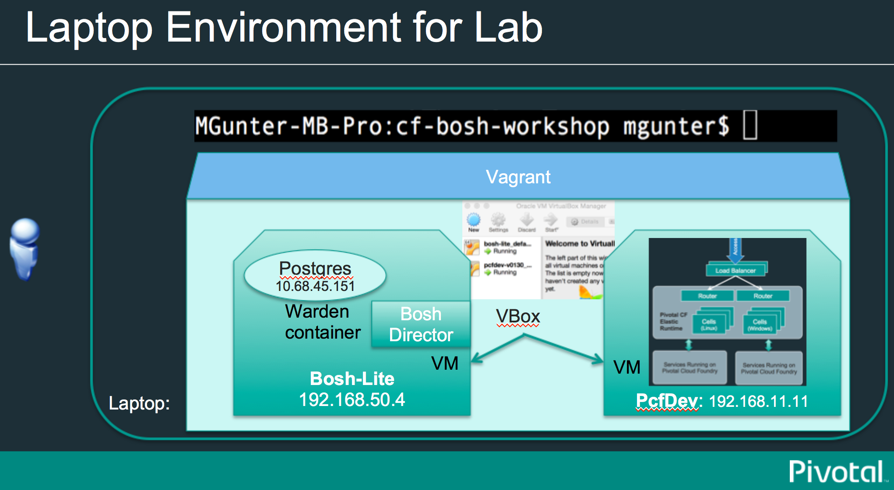
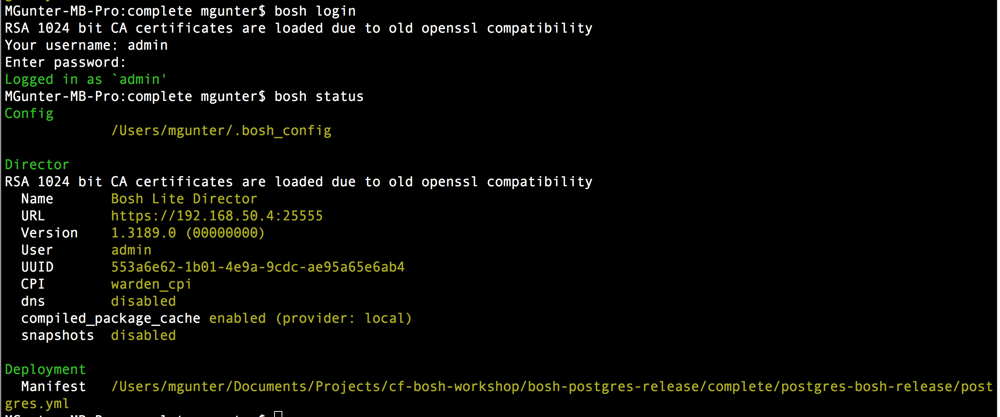
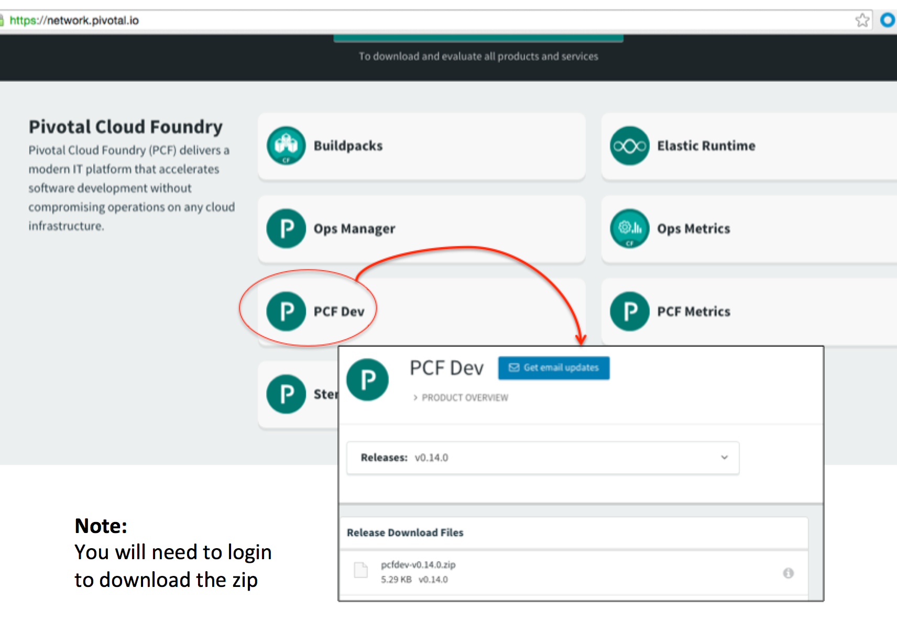

= Lab 1: Set up and Verify bosh-lite and pcfdev

=== Background
Please see https://bosh.io/docs/bosh-lite.html for docs about BOSH Lite.

Please see https://github.com/pivotal-cf/pcfdev.git for docs about Pcfdev.

After the workshop - take a look at http://mariash.github.io/learn-bosh/#introduction which might be a good refresher down the road.

=== Requirements
Download Vagrant and Bosh CLI from cmd line.

----
$ brew cask install vagrant

( virtual box is included in that)

$ sudo gem install bosh_cli --no-ri --no-rdoc

$ git clone https://github.com/cloudfoundry/bosh-lite.git

----

==== 1. Testing your Bosh-Lite environment

  . Use Vagrant to start bosh-lite VM
  
     cd into the /bosh-lite directory run "$vagrant up" and test "$vagrant ssh"
        
     Vagrant exposes ssh port on host machine @ 2222
    
        test "$vagrant ssh "

        
 . Bosh Lite director is running inside the Vagrant vm @ 192.168.50.4
 +
    - bosh user is admin, password is “admin"
+
----    
$ bosh target 192.168.50.4 lite
Target set to `Bosh Lite Director'
Your username: admin
Enter password: *****
Logged in as `admin'
----
+
. Check the status of bosh with "$bosh status"

==== 2. Testing your PCFDev environment

. Download the latest pcfdev-<VERSION>.zip from the https://network.pivotal.io/[Pivotal Network].

. unzip pcfdev
. cd to the /pcfdev directory
. use the commands provided to start PcfDev
  
     run the start script for your os...
     
     "$ ./start_osx "
    
          - In the terminal output: verify how Vagrant chose to port map host port 2200 (instead of 2222)
         
        ----
        ==> default: Waiting for machine to boot. This may take a few minutes...
            default: SSH address: 127.0.0.1:2200
            default: SSH username: vagrant

        
        - cd into the /pcfdev directory  run "$vagrant up" and test "$vagrant ssh"
        
    - Vagrant will then expose the guest ssh port on host machine @ 2223
    
        test connectivity:  "$vagrant ssh "

        
 . PCF is running inside the Vagrant vm @ 192.168.11.11

    .. To login to Pcfdev via the CLI
    
    $  cf login -a api.local.pcfdev.io --skip-ssl-validation <admin/admin>
    
    .. To verify PCF commandline tool connected
    
    $ cf apps  
 (Response should confirm no apps have been pushed.)

end of Lab
