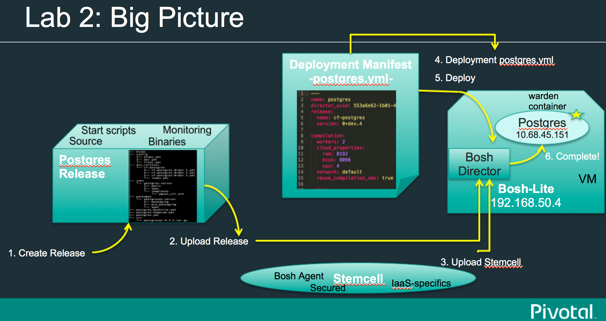
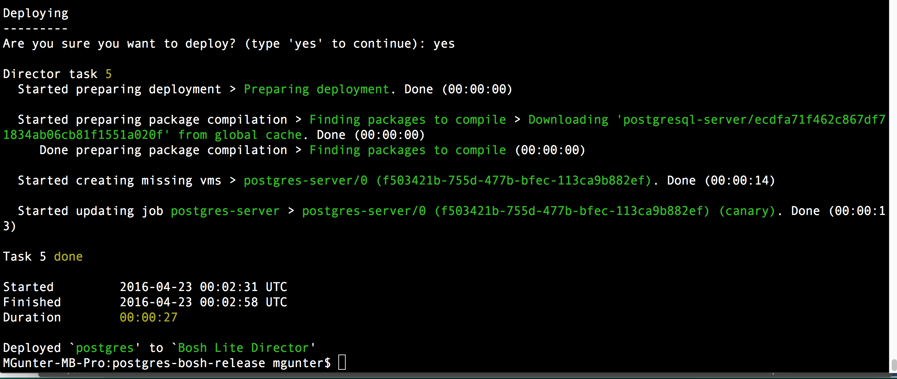

= Lab02: Deploying an Existing Bosh Release

==== *Requirements*

. __BOSH CLI__ installed
. Review http://docs.cloudfoundry.org/bosh/create-release.html[BOSH Documentation - Creating a BOSH release]

==== *1. Deploy Postgres as a Bosh Release*
Start from inside the *$WORKSHOP_HOME/bosh-postgres-release* and let's configure and deploy the completed one:

*$ bosh create release --force*

-- you should see an output like this:
----

Syncing blobs...

Building DEV release
---------------------------------

Building packages
-----------------

Building postgresql...
  Final version:   NOT FOUND
  Dev version:     FOUND LOCAL

Resolving dependencies
----------------------
Dependencies resolved, correct build order is:
- postgresql

Building jobs
-------------
Building postgres-server...
  Final version:   NOT FOUND
  Dev version:     NOT FOUND
  Generating...
  Generated version e922a84539460a018fe1a4e6fecefe6895cb84f8

Building release
----------------

Generating manifest...
----------------------
Writing manifest...

Release summary
---------------
Packages
+-------------------+------------------------------------------+-------+
| Name              | Version                                  | Notes |
+-------------------+------------------------------------------+-------+
| postgresql        | 93f286ed14b430c95752058362625bab41e2308c |       |
+-------------------+------------------------------------------+-------+

Jobs
+-----------------+------------------------------------------+-------------+
| Name            | Version                                  | Notes       |
+-----------------+------------------------------------------+-------------+
| postgres-server | e922a84539460a018fe1a4e6fecefe6895cb84f8 | new version |
+-----------------+------------------------------------------+-------------+

Jobs affected by changes in this release
+-----------------+------------------------------------------+
| Name            | Version                                  |
+-----------------+------------------------------------------+
| postgres-server | e922a84539460a018fe1a4e6fecefe6895cb84f8 |
+-----------------+------------------------------------------+

Release name: cf-postgres
Release version: 0+dev.4
Release manifest: cf-bosh-workshop/postgres-bosh-release/dev_releases/cf-postgres/cf-postgres-0+dev.4.yml
----

Now we should be able to upload the required stemcell and our release.

- Download the Ubuntu Stemcell for Warden:

*$ bosh public stemcells*
----
+-----------------------------------------------------------------+
| Name                                                            |
+-----------------------------------------------------------------+
| bosh-stemcell-2427-aws-xen-ubuntu.tgz                           |
| bosh-stemcell-2652-aws-xen-centos.tgz                           |
| bosh-stemcell-2776-aws-xen-centos-go_agent.tgz                  |
| bosh-stemcell-2427-aws-xen-ubuntu-go_agent.tgz                  |
| bosh-stemcell-2710-aws-xen-ubuntu-lucid-go_agent.tgz            |
| bosh-stemcell-2652-aws-xen-ubuntu-lucid.tgz                     |
| bosh-stemcell-2776-aws-xen-ubuntu-trusty-go_agent.tgz           |
| bosh-stemcell-2690.6-aws-xen-ubuntu-trusty-go_agent.tgz         |
| bosh-stemcell-2719.1-aws-xen-centos-go_agent.tgz                |
| bosh-stemcell-2719.1-aws-xen-ubuntu-trusty-go_agent.tgz         |
| bosh-stemcell-2719.2-aws-xen-centos-go_agent.tgz                |
| bosh-stemcell-2719.2-aws-xen-ubuntu-trusty-go_agent.tgz         |
| bosh-stemcell-2719.3-aws-xen-ubuntu-trusty-go_agent.tgz         |
| light-bosh-stemcell-2427-aws-xen-ubuntu.tgz                     |
| light-bosh-stemcell-2652-aws-xen-centos.tgz                     |
| light-bosh-stemcell-2776-aws-xen-centos-go_agent.tgz            |
| light-bosh-stemcell-2427-aws-xen-ubuntu-go_agent.tgz            |
| light-bosh-stemcell-2710-aws-xen-ubuntu-lucid-go_agent.tgz      |
| light-bosh-stemcell-2652-aws-xen-ubuntu-lucid.tgz               |
| light-bosh-stemcell-2776-aws-xen-ubuntu-trusty-go_agent.tgz     |
| light-bosh-stemcell-2690.6-aws-xen-ubuntu-trusty-go_agent.tgz   |
| light-bosh-stemcell-2719.1-aws-xen-centos-go_agent.tgz          |
| light-bosh-stemcell-2719.1-aws-xen-ubuntu-trusty-go_agent.tgz   |
| light-bosh-stemcell-2719.2-aws-xen-centos-go_agent.tgz          |
| light-bosh-stemcell-2719.2-aws-xen-ubuntu-trusty-go_agent.tgz   |
| light-bosh-stemcell-2719.3-aws-xen-ubuntu-trusty-go_agent.tgz   |
| light-bosh-stemcell-2776-aws-xen-hvm-centos-go_agent.tgz        |
| light-bosh-stemcell-2776-aws-xen-hvm-ubuntu-trusty-go_agent.tgz |
| bosh-stemcell-2427-openstack-kvm-ubuntu.tgz                     |
| bosh-stemcell-2624-openstack-kvm-centos.tgz                     |
| bosh-stemcell-2624-openstack-kvm-ubuntu-lucid.tgz               |
| bosh-stemcell-2776-openstack-kvm-centos-go_agent.tgz            |
| bosh-stemcell-2776-openstack-kvm-ubuntu-trusty-go_agent.tgz     |
| bosh-stemcell-2652-openstack-kvm-ubuntu-lucid-go_agent.tgz      |
| bosh-stemcell-2719.1-openstack-kvm-centos-go_agent.tgz          |
| bosh-stemcell-2719.1-openstack-kvm-ubuntu-trusty-go_agent.tgz   |
| bosh-stemcell-2719.2-openstack-kvm-centos-go_agent.tgz          |
| bosh-stemcell-2719.2-openstack-kvm-ubuntu-trusty-go_agent.tgz   |
| bosh-stemcell-2719.3-openstack-kvm-ubuntu-trusty-go_agent.tgz   |
| bosh-stemcell-2427-vcloud-esxi-ubuntu.tgz                       |
| bosh-stemcell-2652-vcloud-esxi-ubuntu-lucid.tgz                 |
| bosh-stemcell-2732-vcloud-esxi-ubuntu-trusty-go_agent.tgz       |
| bosh-stemcell-2690.5-vcloud-esxi-ubuntu-trusty-go_agent.tgz     |
| bosh-stemcell-2690.6-vcloud-esxi-ubuntu-trusty-go_agent.tgz     |
| bosh-stemcell-2710-vcloud-esxi-ubuntu-lucid-go_agent.tgz        |
| bosh-stemcell-2427-vsphere-esxi-ubuntu.tgz                      |
| bosh-stemcell-2624-vsphere-esxi-centos.tgz                      |
| bosh-stemcell-2776-vsphere-esxi-centos-go_agent.tgz             |
| bosh-stemcell-2427-vsphere-esxi-ubuntu-go_agent.tgz             |
| bosh-stemcell-2710-vsphere-esxi-ubuntu-lucid-go_agent.tgz       |
| bosh-stemcell-2624-vsphere-esxi-ubuntu-lucid.tgz                |
| bosh-stemcell-2776-vsphere-esxi-ubuntu-trusty-go_agent.tgz      |
| bosh-stemcell-2719.1-vsphere-esxi-centos-go_agent.tgz           |
| bosh-stemcell-2719.1-vsphere-esxi-ubuntu-trusty-go_agent.tgz    |
| bosh-stemcell-2719.2-vsphere-esxi-ubuntu-trusty-go_agent.tgz    |
| bosh-stemcell-2719.2-vsphere-esxi-centos-go_agent.tgz           |
| bosh-stemcell-2719.3-vsphere-esxi-ubuntu-trusty-go_agent.tgz    |
| bosh-stemcell-2690.6-vsphere-esxi-ubuntu-trusty-go_agent.tgz    |
| bosh-stemcell-389-warden-boshlite-ubuntu-trusty-go_agent.tgz    |
| bosh-stemcell-53-warden-boshlite-ubuntu.tgz                     |
| bosh-stemcell-389-warden-boshlite-centos-go_agent.tgz           |
| bosh-stemcell-64-warden-boshlite-ubuntu-lucid-go_agent.tgz      |
+-----------------------------------------------------------------+
----
*$ bosh download public stemcell bosh-stemcell-389-warden-boshlite-ubuntu-trusty-go_agent.tgz*
----

bosh-stemcell: 100% |ooooooooooooooooooooooooooooooooooooooooooooooooooooooooooooooooo| 431.4MB   9.1MB/s Time: 00:00:47
Download complete

----

- Verify the manifest file called __postgres.yml__. The default one is shown below. Replace the IaaS properties with the right ones from the environment you'll be testing to.

----
---
name: postgres
director_uuid: 553a6e62-1b01-4e9a-9cdc-ae95a65e6ab4 
release:
  name: cf-postgres
  version: 0+dev.1

compilation:
  workers: 2
  cloud_properties:
    ram: 8192
    disk: 8096
    cpu: 4
  network: default
  reuse_compilation_vms: true 

update:
  canaries: 1
  canary_watch_time: 3000 - 180000
  update_watch_time: 3000 - 180000
  max_in_flight: 2
  max_errors: 1

networks:
 - name: default
   subnets:
   - range: 10.68.45.0/24
     gateway: 10.68.45.1
     dns:
     - 10.103.42.51
     static:
     - 10.68.45.151
     - 10.68.45.152
     - 10.68.45.153
     reserved:
     - 10.68.45.2-10.68.45.150
     cloud_properties:
      name : PCF_SERVICES

resource_pools:
 - name: rp1
   network: default
   stemcell:
    name: bosh-warden-boshlite-ubuntu-trusty-go_agent 
    version: 389
   cloud_properties:
    ram: 16500
    disk: 7128
    cpu: 2
   env:
    bosh:
      password: $6$2f6qtRfO$oJOeKk/ZDNb7PWnvMiXDC/HstKiLiZCBHP32KHFVeM9rXgs4W/JJiI4a/eHoddhxJzorLYgi2JUQiOKxZko4M.
      # c1oudc0w - password generated using mkpasswd -m sha-512

jobs:
 - name: postgres-server
   template: postgres-server
   instances: 1
   resource_pool: rp1
   persistent_disk: 7128
   properties:
     host: 10.68.45.151
   networks:
   - name: default
     static_ips:
     - 10.68.45.151

properties:
     host: 10.68.40.201
----
You must set the UUID to match your Bosh Director.....

 (hint:  find the Bosh Director UUID to target with "bosh status --uuid" )

When in doubt, you can always check the deployment manifest reference http://docs.cloudfoundry.org/bosh/deployment-manifest.html[here]

==== *2. Testing the release*:

*$ bosh target 192.168.50.4*

----
Target set to `Bosh Lite Director'
----

*$ bosh login*
----
Your username: admin
Enter password: 
Logged in as `admin'
----
*$ bosh upload stemcell bosh-stemcell-389-warden-boshlite-ubuntu-trusty-go_agent.tgz*

----

Acting as user 'admin' on 'Bosh Lite Director'

Verifying stemcell...
File exists and readable                                     OK
Verifying tarball...
Read tarball                                                 OK
Manifest exists                                              OK
Stemcell image file                                          OK
Stemcell properties                                          OK

Stemcell info
Name:    bosh-warden-boshlite-ubuntu-trusty-go_agent
Version: 389
( truncated output )

----
*$ bosh upload release*
----

Acting as user 'admin' on 'Bosh Lite Director'

Copying packages
~----------------
postgresql-server

Copying jobs
~------------
postgres-server

Generated /var/folders/1w/xz6h_k810l7986wcll7xzfyr0000gp/T/d20160422-29852-o4ykud/d20160422-29852-1sv6amz/release.tgz
Release size: 20.2M

Verifying manifest...
Extract manifest                                             OK
Manifest exists                                              OK
Release name/version                                         OK

Uploading release
( truncated output )

----
*$ bosh deployment postgres.yml*

----

Deployment set to `..cf-bosh-workshop/bosh-postgres-release/postgres.yml'

----
*$ bosh deploy*
----

Acting as user 'admin' on deployment 'postgres' on 'Bosh Lite Director'
Getting deployment properties from director...
Unable to get properties list from director, trying without it...

Detecting deployment changes
~----------------------------
resource_pools:
( truncated output )

At the end of the Deploy step the terminal should look like the screenshot below:
----

==== NOTES: some common things to look for:
- can you bosh ssh into the postgres container?

- from inside the posgres containr, can you ps -ef|grep postgres (and see 5 processes?)

- did you change your UUID in postgres.yml?

- did you change your version in postgres.yml?

- networking issue...Access to the postgres server from the host requires a static route - did you edit and run bin/add-route?

-- Use bin/add-route command from /bosh-lite to add a static rout to containers via VM

-- Note: this add-route file *may not be correct* for the 10.68.45.0/24 network configured in the Postgres release deployment manifest https://raw.githubusercontent.com/mgunter-pivotal/cf-bosh-workshop/master/bosh-postgres-release/postgres.yml[here]

-- Here are the recommended "add-route" file settings for this workshop:
----
old_ips="10.68.0.0/16"
ips="10.68.0.0/16"
gw="192.168.50.4"
----

end of Lab
