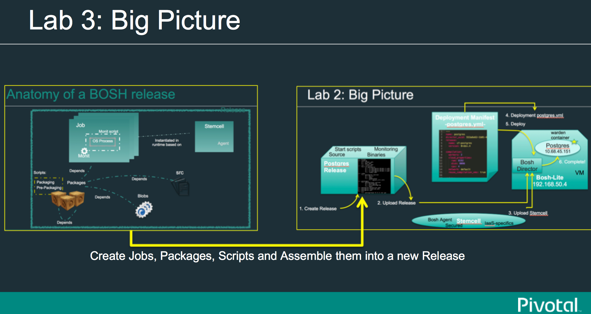

= Lab03: Creating a Bosh Release "from scratch"

==== *Some things to think about as you build your BOSH release:*
 - 1.  It's useful to practice the manual steps needed to compile, install, and run the "Thing" (in this case Postgres) on an Ubuntu Linux VM.
 - 2.  What file system locations are important?  How can you specify non-default directory locations?
 - 3.  What additional OS dependencies are needed for running?  How can you automate the installation of those dependencies from BASH?
 - 4.  If your release will be comprised of a collection of VMs, what properties from each VM will need to be shared and how could you set those properties from variables in BASH script?
 - 5.  Do you need to do anything special to stop your service and how would you do that from the linux prompt?
 - 6.  Do I want to connect this Thing to an Enterprise monitoring and management solution once provisioned?  What needs to happen on the VM to make that happen?  What properties would need to be collected before deploying my BOSH deployment?

==== *Requirements*
 - Install the "tree" utility.  "$ brew install tree".
 
==== *1. Create a Postgres Bosh Release*
Start from inside the *$WORKSHOP_HOME/* and let's create a *New* one:

*$ bosh init release my_postgres_release*

-- you should see an output like this:

----
Release directory initialized
----

*$ cd my_postgres_release*

*$ tree*

----
├── blobs
├── config
│   └── blobs.yml
├── jobs
├── packages
└── src
----

--

*$ bosh generate job my-pg-server*
----
create	jobs/my-pg-server

create	jobs/my-pg-server/templates

create	jobs/my-pg-server/spec

create	jobs/my-pg-server/monit

Generated skeleton for `my-pg-server' job in `jobs/my-pg-server'
----

- Check the directory tree again 
----
$ tree
.
├── blobs
├── config
│   ├── blobs.yml
│   ├── dev.yml
│   └── final.yml
├── dev_releases
│   └── my-postgres
├── jobs
│   └── my-pg-server
│       ├── monit
│       ├── spec
│       └── templates
├── packages
│   └── my-pg-pkg
│       ├── packaging
│       ├── pre_packaging
│       └── spec
├── postgres.yml
└── src
----
- For each job created, check the files jobs/<job_name>/spec and jobs/<job_name>/monit. In this case:
----
$ more jobs/my-pg-server/spec
$ more jobs/my-pg-server/monit
----
- Let's now create a template for starting/stopping the job. Create a file on the __templates__ directory, naming it __pgsql_ctl.erb__

source for jobs/my-pg-server/templates/pgsql_ctl.erb
----
#!/bin/bash -e

LOG_DIR=/var/vcap/sys/log/my-pg-server
DATA_DIR=/var/vcap/jobs/my-pg-server/data
BASE_DIR=/var/vcap/packages/my-pg-pkg
BINARY_DIR=$BASE_DIR/bin

case $1 in
  start)

   if ! test -d $LOG_DIR; then

      sudo mkdir $LOG_DIR
      sudo chown -R vcap:vcap $LOG_DIR
   fi

   if ! test -d $DATA_DIR; then
      mkdir $DATA_DIR
      sudo chown -R vcap:vcap $DATA_DIR
      sudo chmod 700 $DATA_DIR

      sudo -u vcap $BINARY_DIR/pg_ctl initdb -D $DATA_DIR -o "--auth=trust"

      # enable TCP/IP connections
      sed -i "s/#listen_addresses = 'localhost'/listen_addresses = '*'/g" $DATA_DIR/postgresql.conf
      sed -i 's/#port = 5432/port = 5432/g' $DATA_DIR/postgresql.conf
      echo 'host		all	all	0.0.0.0/0	trust' >>$DATA_DIR/pg_hba.conf 
 

   fi
 
   sudo -u vcap $BINARY_DIR/pg_ctl start -l $LOG_DIR/server.log -D $DATA_DIR

    ;;

  stop)

    sudo -u vcap $BINARY_DIR/pg_ctl stop -D $DATA_DIR -l $LOG_DIR/server.log

    ;;

  *)
    echo "Usage: pgsql_ctl {start|stop}"

    ;;

esac
----

For discussion: There are several methods for implementing Postgresql HA.   See http://www.postgresql.org/docs/9.4/static/different-replication-solutions.html  What kinds of things would we need to do if we wanted to implement Transaction Log Shipping?  What other changes to pg_hba.conf would be needed upon first start?  How would settings differ if the job role is the standby server.  How could you inject DB settings such as max_wal_senders?

The instructor will discuss the contents of that file with you.
Although not really used in this example, you can find out more on ruby ERB templating http://www.rrn.dk/rubys-erb-templating-system/[here]

- Now edit the __monit__ script to look like

----
check process psql
  with pidfile /var/vcap/jobs/my-pg-server/data/postmaster.pid
  start program "/var/vcap/jobs/my-pg-server/bin/pgsql_ctl start" with timeout 600 seconds
  stop program "/var/vcap/jobs/my-pg-server/bin/pgsql_ctl stop"
  group vcap
----

This script is responsible for starting and stopping our job. See it references a file called __pgsql_ctl__, and that will be generated based on the template __pgsql_ctl.erb__ we already created on a previous step.

- Let's now work on the  __spec__ file for that job:

----
name: my-pg-server

templates:
  pgsql_ctl.erb: bin/pgsql_ctl

packages:
- my-pg-pkg
----

That tells bosh to create a __bin/pgsql_ctl__ script based on our __pgsql_ctl.erb__ template. We could use BOSH variables in this file, and the transformations would be applied when compiling the job.

At this point we should have our *job* almost completed. Install script based on sources is ready, Monit knows what to monitor and what scripts to call in order to start/stop the process, and the script to start the server is created. 
Let's generate now the package itself, with the installer and other configurations needed in order to run this process.

- Now we'll work on the package the job depends upon. Start by generating the __postgresql__ package:

*$ bosh generate package my-pg-pkg*

----
create	packages/my-pg-pkg
create	packages/my-pg-pkg/packaging
create	packages/my-pg-pkg/pre_packaging
create	packages/my-pg-pkg/spec

Generated skeleton for `my-pg-pkg' package in `packages/my-pg-pkg'
----

- Now check the __spec__ and __packaging__ scripts for the package created. Change the __spec__ file to include the PostgreSQL sources we'll use to compile the package:

----
name: my-pg-pkg

dependencies:

files:
- postgresql-9.3.5.tar.gz  # from http://www.postgresql.org/ftp/source/v9.3.5/
----

Note: Download the file indicated above and place it under the __src__ directory. BOSH will look for that file under __src__ and __blobs__.

- Now edit the __packaging__ script for that package to install the sources:

----
# abort script on any command that exits with a non zero value
# abort script on any command that exits with a non zero value
set -e

tar zxvf postgresql-9.3.5.tar.gz
pushd postgresql-9.3.5
  # need to run as root?
  # sudo su -
  ./configure --prefix=${BOSH_INSTALL_TARGET}

  make
  make install
popd

# post-install procedures
LD_LIBRARY_PATH=/usr/local/pgsql/lib
export LD_LIBRARY_PATH
----

- Although we don't have blobs for this release (we're providing everything needed as source), it's mandatory to configure a blobstore, so we'll do a dummy config.
Create the file __config/final.yml__ and paste the following:

----
---
final_name: my-postgres
min_cli_version: 1.5.0.pre.1142
blobstore:
  provider: local
  options:
    blobstore_path: /tmp/postgres-blobs
----

That should be all for the package.

- Build the dev release:
----
$ bosh create release --force
----

you should see an output like this:

----
Syncing blobs...

Building DEV release
~--------------------------------
Release artifact cache: /Users/mgunter/.bosh/cache

Building license
~---------------
Building license...
  Warning: Missing LICENSE or NOTICE in /Users/mgunter/Documents/Customers/UltimateSW/cf-bosh-workshop/my_postgres_release

Building packages
~----------------
Building my-pg-pkg...
  Using dev version 'c6b28260673161ebe4f51422075e9afa0d2c8384'

Resolving dependencies
~---------------------
Dependencies resolved, correct build order is:
- my-pg-pkg

Building jobs
~------------
Building my-pg-server...
  Using dev version '0e57399d0c55b2984d334710629beeeb6a347298'

Building release
~---------------

Generating manifest...
~---------------------
Writing manifest...

Release summary
~--------------
Packages
+-----------+------------------------------------------+-------+
| Name      | Version                                  | Notes |
+-----------+------------------------------------------+-------+
| my-pg-pkg | c6b28260673161ebe4f51422075e9afa0d2c8384 |       |
+-----------+------------------------------------------+-------+

Jobs
+--------------+------------------------------------------+-------+
| Name         | Version                                  | Notes |
+--------------+------------------------------------------+-------+
| my-pg-server | 0e57399d0c55b2984d334710629beeeb6a347298 |       |
+--------------+------------------------------------------+-------+

Release name: my-postgres
Release version: 0+dev.2
Release manifest: /Users/mgunter/Documents/Customers/UltimateSW/cf-bosh-workshop/my_postgres_release/dev_releases/my-postgres/my-postgres-0+dev.2.yml
----
--

After creating it, we must upload it to the bosh director:

----
$ bosh upload release 
 ( missing output)
Uploading release
release.tgz:    96% |oooooooooooooooooooooooooooooooooooooooooooooooooooo   |   1.3KB 121.8KB/s ETA:  00:00:00
Director task 85
  Started extracting release > Extracting release. Done (00:00:00)
  
  Started verifying manifest > Verifying manifest. Done (00:00:00)

  Started resolving package dependencies > Resolving package dependencies. Done (00:00:00)

  Started processing 1 existing package > Processing 1 existing package. Done (00:00:00)

  Started processing 1 existing job > Processing 1 existing job. Done (00:00:00)

  Started release has been created > my-postgres/0+dev.11. Done (00:00:00)
 
Task 85 done

Started		2016-04-24 05:47:07 UTC
Finished	2016-04-24 05:47:07 UTC
Duration	00:00:00
release.tgz:    96% |oooooooooooooooooooooooooooooooooooooooooooooooooooo   |   1.3KB    324B/s Time: 00:00:04

Release uploaded
----

==== 2. We will need a "postgres.yml" file for deploying this release.

-- Use the one from Lab 2 as an example and make the following changes --

. Change the names of the deployment, release, job, and job template. Also make the release version MATCH the lastest upload:
+
----
---
name: my-postgres
director_uuid: 553a6e62-1b01-4e9a-9cdc-ae95a65e6ab4 
release:
  name: my-postgres
  version: 0+dev.3
----  

. Change the static IP address for the job as shown below:

----
jobs:
 - name: my-pg-server
   template: my-pg-server
   instances: 1
   resource_pool: rp1
   persistent_disk: 7128
   properties:
     host: 10.68.45.151
   networks:
   - name: default
     static_ips:
     - 10.68.45.152
----     

==== 3. Finally Deploy the release

- Set Deployment for the dev release:

*$ bosh deployment postgres.yml*

- deploy the dev release:

*$ bosh deploy*

----
RSA 1024 bit CA certificates are loaded due to old openssl compatibility
Acting as user 'admin' on deployment 'my-postgres' on 'Bosh Lite Director'
Getting deployment properties from director...
Unable to get properties list from director, trying without it...

Detecting deployment changes
~---------------------------
resource_pools:
- name: rp1
  network: default
  stemcell:
    name: bosh-warden-boshlite-ubuntu-trusty-go_agent
    version: '389'
  cloud_properties:
    ram: 16500
    disk: 7128
    cpu: 2
  env:
    bosh:
      password: <redacted>
compilation:
  workers: 2
  cloud_properties:
    ram: 8192
    disk: 8096
    cpu: 4
  network: default
  reuse_compilation_vms: true
networks:
- name: default
  subnets:
  - range: 10.68.45.0/24
    gateway: 10.68.45.1
    dns:
    - 10.103.42.51
    static:
    - 10.68.45.151
    - 10.68.45.152
    - 10.68.45.153
    reserved:
    - 10.68.45.2-10.68.45.150
    cloud_properties:
      name: PCF_SERVICES
update:
  canaries: 1
  canary_watch_time: 3000 - 180000
  update_watch_time: 3000 - 180000
  max_in_flight: 2
  max_errors: 1
jobs:
- name: my-pg-server
  template: my-pg-server
  instances: 1
  resource_pool: rp1
  persistent_disk: 7128
  properties:
    host: <redacted>
  networks:
  - name: default
    static_ips:
    - 10.68.45.152
name: my-postgres
director_uuid: 553a6e62-1b01-4e9a-9cdc-ae95a65e6ab4
release:
  name: my-postgres
  version: 0+dev.11
properties:
  host: <redacted>
Please review all changes carefully

Deploying
~--------
Are you sure you want to deploy? (type 'yes' to continue): yes

Director task 86
  Started preparing deployment > Preparing deployment. Done (00:00:00)

  Started preparing package compilation > Finding packages to compile. Done (00:00:00)

  Started creating missing vms > my-pg-server/0 (9c2e7163-b4df-451c-97a0-3c929af0a0fa). Done (00:00:01)

  Started updating job my-pg-server > my-pg-server/0 (9c2e7163-b4df-451c-97a0-3c929af0a0fa) (canary). Done (00:00:13)

Task 86 done

Started		2016-04-24 05:47:22 UTC
Finished	2016-04-24 05:47:36 UTC
Duration	00:00:14

Deployed `my-postgres' to `Bosh Lite Director'
----

==== 4. Let's confirm that postgres is up and listening:

( You can also use pgadmin to connect to the database with vcap/vcap )

*$telnet 10.68.45.152 5432*

----
Trying 10.68.45.152...
Connected to 10.68.45.152.
----

end of Lab
