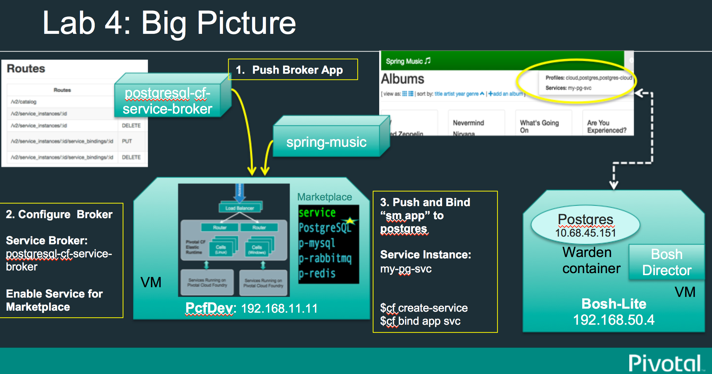
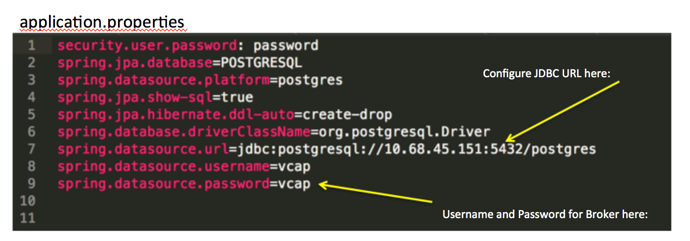
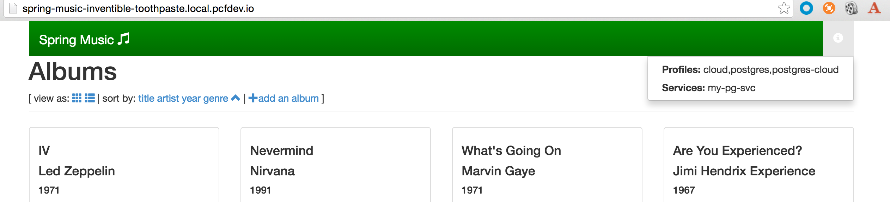

= Lab04: Deploying an Existing postgres Broker for Cloud Foundry

== Configure and Deploy a Cloud Foundry Service Broker for a PostgreSQL instance 

A Cloud Foundry Service Broker for a PostgreSQL instance built based on https://github.com/spring-cloud/spring-cloud-cloudfoundry-service-broker[Spring Cloud Service Broker]

The broker currently publishes a single service and plan for provisioning PostgreSQL databases via cloud foundry's *cf create-service* command




== *Requirements*
 - Download the maven.
 

 - Download the spring-music application. 
 
 ----
 git clone https://github.com/scottfrederick/spring-music.git
 ----

=== Design 

The broker uses a PostgreSQL table for it's meta data. It does not maintain an internal database so it has no dependencies besides PostgreSQL.

http://docs.cloudfoundry.org/services/api.html[Service Broker API]: 2.8

If you have detailed questions about the API and Payloads, those details are documented at the above link.


#### API overview
Routes
|===
|Routes|Method|Description|
|------|------|-----------|
|/v2/catalog|GET|Service and its plan details by this broker|
|/v2/service_instances/:id|PUT|create a dedicated database for this service|
|/v2/service_instances/:id|DELETE|delete previously created database for this service|
|/v2/service_instances/:id/service_bindings/:id|PUT|create user and grant privilege for the database associated with service.|
|/v2/service_instances/:id/service_bindings/:id|DELETE|delete the user created previously for this binding.|
|===

=== Note - Broker can also run as a spring boot app

Simply run the JAR file.
The PostgreSQL jdbc url, etc. is configured in application.properties as described below.

Commandline would be:
----
$ java -jar target/postgresql-cf-service-broker-2.4.0-SNAPSHOT.jar
----

== Lab Steps:

==== *1. Build the broker app*

Review the application.properties so that the JDBC url and username and password are correct for your test instance of Postgres.




Then you are ready to build with maven:

....
mvn package -DskipTests   
....

==== *2. Create and bind the Security Group*

To allow a connection from PCF to the Database (for 10.68.45.151)  a _security group rule_ must be created.
The file - postgresql.json - is included and contains the following default payload to use for this workshop.:
```
[{"protocol":"tcp","destination":"10.68.45.0/24","ports":"5432"}]
```

import this into CF with:
```
cf create-security-group postgresql-service postgresql.json
```

Bind to the full cf install:
```
cf bind-running-security-group postgresql-service
```


==== *3. Push the broker to PCF*
```
cf push postgresql-cf-service-broker -p target/postgresql-cf-service-broker-2.4.0-SNAPSHOT.jar --no-start
```

Export the following environment variables:

```
cf set-env postgresql-cf-service-broker JAVA_OPTS "-Dsecurity.user.password=mysecret"
```

Start the service broker app:
```
cf start postgresql-cf-service-broker
```

Create Cloud Foundry service broker:
```
cf create-service-broker postgresql-cf-service-broker user mysecret http://postgresql-cf-service-broker.local.pcfdev.io <-- must point to broker url bound via cf push above
```

==== *4. Enable the broker for the CF Marketplace*
Add service broker to Cloud Foundry Marketplace:
```
cf enable-service-access PostgreSQL -p "Basic PostgreSQL Plan" -o pcfdev-org
```


-- For more details on Registering a Broker with the Cloud Controller -See http://docs.cloudfoundry.org/services/managing-service-brokers.html[Managing Service Brokers].


==== *5. Test the broker with Spring-Music*

-- As a Developer, I now need to create a service instance from the marketplace

```
$ cf marketplace
Getting services from marketplace in org pcfdev-org / space pcfdev-space as admin...
OK

service      plans                    description   
"PostgreSQL   Basic PostgreSQL Plan*   PostgreSQL on shared instance. "  
p-mysql      512mb, 1gb               MySQL databases on demand   
p-rabbitmq   standard                 RabbitMQ is a robust and scalable high-performance multi-protocol messaging broker.   
p-redis      shared-vm                Redis service to provide a key-value store   
```

-- This is the command to create an instance call "my-pg-svc"
```
$ cf create-service PostgreSQL "Basic PostgreSQL Plan"  my-pg-svc
```

-- Now let's *push* Spring-Music and bind to this service instance.

```
$ cd spring-music
```

```
spring-music:$ ./gradlew assemble
```

```
spring-music:$ cf push spring-music

(output truncated)
...
requested state: started
instances: 1/1
usage: 512M x 1 instances
"urls: spring-music-inventible-toothpaste.local.pcfdev.io"
last uploaded: Sun Apr 24 14:32:26 UTC 2016
stack: cflinuxfs2
buildpack: java-buildpack=v3.6-offline-httpsgithub.com/cloudfoundry/java-buildpack.git#5194155 open-jdk-like-jre=1.8.0_71 open-jdk-like-memory-calculator=2.0.1_RELEASE spring-auto-reconfiguration=1.10.0_RELEASE tomcat-access-logging-support=2.5.0_RELEASE tomca...

     state     since                    cpu    memory           disk           details   
#0   running   2016-04-24 10:32:51 AM   0.0%   317.1M of 512M   154.7M of 1G      

```
--  After pushing, then *bind* the spring-music app to our "my-pg-svc" instance.

```
$ cf bind-service spring-music my-pg-svc
```

-- Restage the app. Then browse to the app url and take a look at the *(i)* link (upper right of page) to confirm it is connected to postgres

```
$ cf restage spring-music
```

-- You should see the following in the browser:




end of Lab
