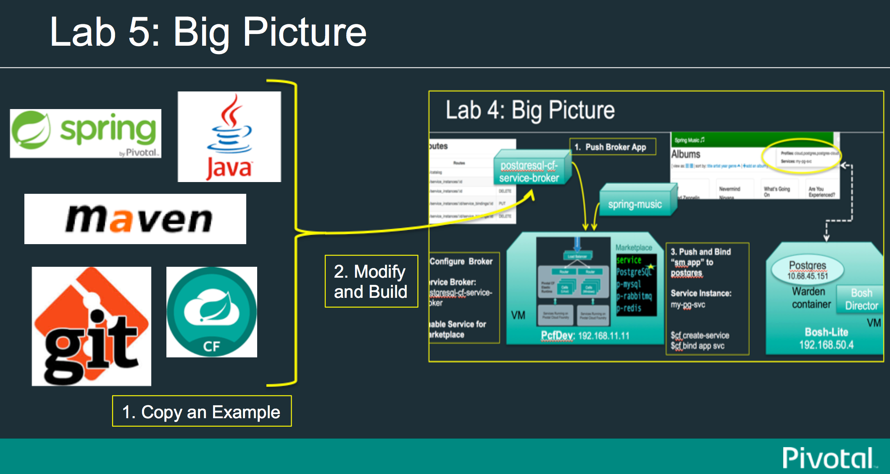

= Lab05: Create a Spring-based Service Broker for Cloud Foundry "From an Example"

==== *Review Spring Cloud Service Broker*
 - Located at https://github.com/spring-cloud/spring-cloud-cloudfoundry-service-broker
 
==== *Download the starter example project*
 - Download and unzip the source repository for the Spring Service Broker example project, or clone it using Git: 

  git clone https://github.com/spring-cloud-samples/cloudfoundry-service-broker.git
  
  - This example is for *MongoDB*, but you can use it as a starting point for any service broker implementation.
  - Review the source code for the following java classes (13 files). (Note you can use Eclipse or IntelliJ or just a text editor)
  

----
$ cd cloudfoundry-service-broker

cloudfoundry-service-broker$ ls
README.md	gradle		gradlew.bat	mvnw		pom.xml
build.gradle	gradlew		manifest.yml	mvnw.cmd	src

cloudfoundry-service-broker$ cd src/main/
main$ tree
├── java
│   └── org
│       └── springframework
│           └── cloud
│               └── servicebroker
│                   └── mongodb
│                       ├── Application.java
│                       ├── config
│                       │   ├── CatalogConfig.java
│                       │   └── MongoConfig.java
│                       ├── exception
│                       │   └── MongoServiceException.java
│                       ├── model
│                       │   ├── ServiceInstance.java
│                       │   └── ServiceInstanceBinding.java
│                       ├── repository
│                       │   ├── MongoServiceInstanceBindingRepository.java
│                       │   └── MongoServiceInstanceRepository.java
│                       └── service
│                           ├── MongoAdminService.java
│                           ├── MongoServiceInstanceBindingService.java
│                           └── MongoServiceInstanceService.java
└── resources
    ├── application.yml
    └── log4j.xml
12 directories, 13 files

----
  
  
 
==== *Modify the starter project*

-- Due to time constraints, you will just copy source files from the "/main" directory of the *postgresql-cf-service-broker* project that is part of this workshop -Lab04. This will convert the Mongo Broker project into a Postgresql Broker.

-- Open a few of the files and review the implementation. 

----
$ cd postgresql-cf-service-broker/

postgresql-cf-service-broker $ cd src/main/
main $ tree
.
├── java
│   └── org
│       └── cloudfoundry
│           └── community
│               └── servicebroker
│                   └── postgresql
│                       ├── config
│                       │   ├── Application.java
│                       │   └── BrokerConfiguration.java
│                       ├── model
│                       │   └── ServiceInstance.java
│                       ├── repository
│                       │   └── PostgresServiceInstanceRepository.java
│                       └── service
│                           ├── DatabaseAdmin.java
│                           ├── PostgreSQLDatabase.java
│                           ├── PostgreSQLServiceInstanceBindingService.java
│                           ├── PostgreSQLServiceInstanceService.java
│                           ├── Role.java
│                           └── Utils.java
└── resources
    └── application.properties

11 directories, 11 files
----

==== *Implement the logic*
-- As mentioned above -Replace the mongodb "/main" directory with the postgresql "/main" directory

-- Repace mongodb pom.xml with the one from the postgres project

-- rm -r on the mongo broker's src/test directory (It is also possible to just copy the test classes from the postgres broker project.)

-- Make a trivial change to the broker code. *One option is to change the name of the plan to Ultimate from Basic*:
.. change *BrokerConfiguration.java* 

..from

----
private static List<Plan> getPlans() {
        Plan basic = new Plan("postgresql-basic-plan", "Basic PostgreSQL Plan",
                "A PG plan providing a single database on a shared instance with limited storage.", getBasicPlanMetadata());
        return Arrays.asList(basic);
    }
----

..to

----
private static List<Plan> getPlans() {
        Plan basic = new Plan("postgresql-basic-plan", "Ultimate PostgreSQL Plan",
                "A PG plan providing a single database on a shared instance with limited storage.", getBasicPlanMetadata());
        return Arrays.asList(basic);
    }
----

==== *Build the New Broker*

-- mvn package -DskipTests 

==== *Follow Lab 4's Push instructions and Test the broker app with Spring Music.* 

-- *You can also just test the REST api*

-- example url for the rest api (user/mysecret). Look for "Ultimate" in the plan name.
 Go to this REST endpoint: http://postgresql-cf-service-broker2.local.pcfdev.io/v2/catalog

The browser should return a json payload with the following content embedded:
----
"plans":[{"id":"postgresql-basic-plan","name":"Ultimate PostgreSQL Plan"
----

end of Lab5
